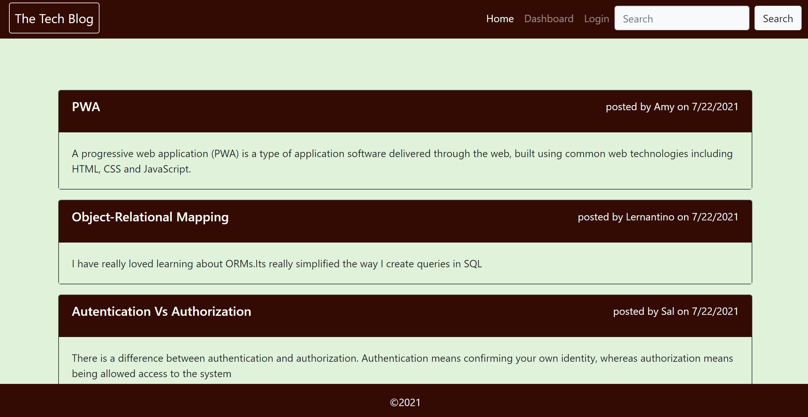
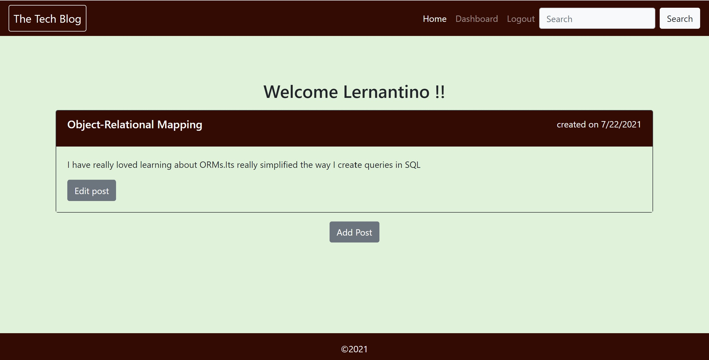
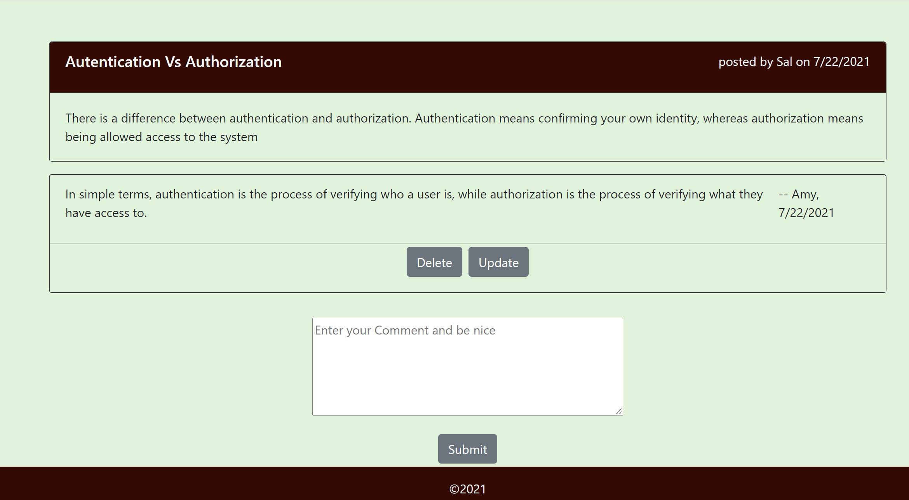

# Tech-Blog

## Description

The Tech-Blog is a CMS-style blog site similar to a Wordpress site, where developers can publish their blog posts and comment on other developer's posts. In this app Developers can also search the posts by writing keywords in search box.They can also update, delete and add the blog posts as well as their comments on other's developers blog posts. This App is following the MVC paradigm in its architectural structure, using Handlebars.js as the templating language, Sequelize as the ORM, and the express-session npm package for authentication.

## Key Learning:

1. Node.js
2. NPM packages nodemon ,bcrypt,connect-session-sequelize,dotenv,express,  
   express-handlebars,express-session,mysql2,sequelize

## Table of Contents

- [Installation](#Installation)
- [Usage](#Usage)
- [License](#License)
- [Contributors](#Contributors)
- [Tests](#Tests)
- [Technologies](#Technologies)
- [Questions](#Questions)

## Installation

- Clone project into a local directory and cd into that directory.
- Install mysql and create a local database required for app and create a .env file same
  as example .env file
- On console run npm install. It will install all packages needed to run app.
- Run the command npm start/npm run watch and verify server start message in console.
- Navigate to port 3001 of your localhost to use application locally.

## Usage

- Homepage

  

- User Dashboard

  

- User Comments

  

- Mock Up

  

- Deployed Link at Heroku

  [View App Here](https://my-tech-blog-123.herokuapp.com/)

## License

- The application is covered under the license MIT. For more Info please visit [License Info](https://opensource.org/licenses/MIT)

## Contributors

- None

## Tests

- None

## Technologies

- `Node.js`
- `Express`
- `MySQL`
- `Sequelize`
- `Handlebars`
- `Insomnia`
- `HTML,CSS,JavaScript`
- `Bootstrap CSS Framework`

## Questions

If you have any questions about project you can either contact me or visit my github profile.

Link to my Github: [Github](https://github.com/gunjanb)

Email address :[gunjanbhargava2021@gmail.com](mailto:gunjanbhargava2021@gmail.com)
